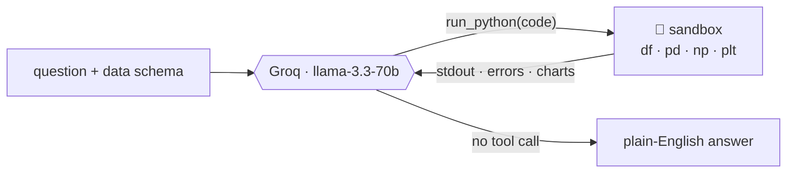

<h1 align="center">📊 AutoAnalyst</h1>

<p align="center">
  <b>An agent that writes and runs its own data analysis.</b><br>
  Ask a question in plain English → AutoAnalyst writes Python, runs it against your
  data, reads the result, draws charts, and explains the answer — one step at a time.
</p>

<p align="center">
  
  
  
  
  
  <a href="https://pypi.org/project/autoanalyst/"></a>
  <a href="https://huggingface.co/spaces/Abdullahkousa2/autoanalyst"></a>
</p>

---

## What is this?

AutoAnalyst is a local, open-source take on ChatGPT's *Advanced Data Analysis*. The
difference from a normal "ask the LLM" tool is the **agent loop**: instead of guessing
an answer in one shot, the model is given a single tool — `run_python` — and a live
Python session with your DataFrame already loaded. It **writes code, runs it, sees the
real output, and decides what to do next**, repeating until it can answer.

Because every number it reports comes from code that actually executed against your
data, the answers are *grounded* — not hallucinated.

## The agent loop



- **One tool, real execution.** The model writes pandas/matplotlib; the sandbox runs it.
- **Persistent session.** Variables (and `df`) survive across steps, like a notebook.
- **Self-correcting.** If code raises, the error is fed back and the model fixes it.
- **Charts come back as images;** the model only hears "a chart was rendered."

## ▶ Live demo

Try it on the **[Hugging Face Space](https://huggingface.co/spaces/Abdullahkousa2/autoanalyst)** —
pick a dataset, ask a question, and watch the agent think in real time (the UI streams
each step over Server-Sent Events).

## Quickstart

### Install

```bash
pip install autoanalyst
```

Set a free [Groq](https://console.groq.com) key (put it in a `.env` file or your env):

```bash
GROQ_API_KEY=gsk_...
```

### Use the CLI

```bash
autoanalyst -q "What was the survival rate by passenger class?" --csv titanic.csv
```

You'll see each step it runs — the code, the output, chart markers — then the answer.

### Run the web demo locally

```bash
pip install "autoanalyst[serve]"
uvicorn app.server:app --port 8000
# open http://localhost:8000
```

You can **upload your own CSV/Excel** — both locally and on the hosted demo — or use the bundled samples.

## How it works

| Piece | File | What it does |
|---|---|---|
| **Sandbox** | `autoanalyst/sandbox.py` | Persistent exec namespace; captures stdout + matplotlib figures (as PNGs); AST-based denylist + per-step timeout. |
| **Agent** | `autoanalyst/agent.py` | The Groq tool-calling loop → an ordered trace of steps + a final answer. Also exposes `run_iter` for streaming. |
| **Data I/O** | `autoanalyst/dataio.py` | Loads CSV/Excel and builds the compact schema summary the model sees. |
| **Prompts** | `autoanalyst/prompts.py` | System prompt + the `run_python` tool schema (single source of truth). |
| **Server** | `app/server.py` | FastAPI: health, datasets, upload, `/api/analyze` and the SSE `/api/analyze/stream`. |
| **UI** | `app/static/` | Custom dark "analyst lab" frontend — live trace, syntax-highlighted code, inline charts. |

## Sample datasets

Four bundled, recognizable datasets (built by `scripts/make_samples.py`):
**Titanic** (survival), **restaurant tips**, **Palmer penguins**, and a generated
**e-commerce sales** table — each with a few verified example questions.

## Safety

LLM-written code is executed, so the sandbox applies a **pragmatic** guard: an AST
denylist (no `os`/`subprocess`/`socket`/file or network access), a per-snippet timeout,
and capped output. Uploads are size-capped and type-checked, and the hosted demo runs
inside a **non-root container**. It is *not* a bulletproof jail, though — treat it as a
demo, not a place to run sensitive data.

## Limitations

- Built on an **open 70B model** via Groq — tool-calling is good but occasionally needs
  a retry on a malformed call (handled with a step cap and a forced final answer).
- It answers from the data you give it; it won't fetch external context.
- Groq geo-restricts some regions; the hosted Space runs where Groq is reachable.

## Tech

QLoRA-free and GPU-free by design: **Groq API · pandas · numpy · matplotlib · FastAPI ·
Server-Sent Events**. Tested (GPU- and network-free) in CI.

## License

MIT — see [LICENSE](LICENSE).
